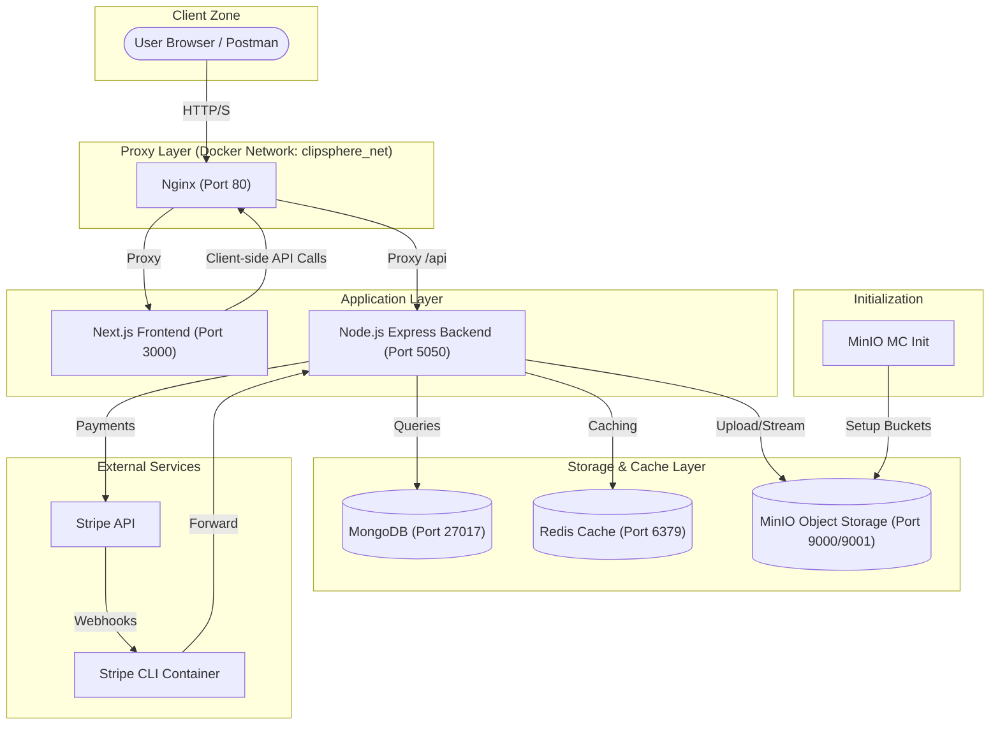

# ClipSphere Full Architecture Diagram

The following diagram illustrates the containers, networks, and data flow within the ClipSphere platform.

## Data Flow Details

1.  **Authentication**: Handled by Backend using JWT and MongoDB.
2.  **Video Upload**:
    - Backend receives file via `multer`.
    - `ffprobe` checks duration.
    - File is streamed to **MinIO** `clipsphere-videos` bucket.
    - Thumbnail generated via `ffmpeg` and saved to `clipsphere-thumbnails` bucket.
3.  **Video Streaming**:
    - Backend generates presigned URLs or streams data directly from MinIO to the client.
4.  **Social Graph**:
    - Following/Follower relationships stored in MongoDB.
    - Used for the **Following Boost Feed**.
5.  **Payments**:
    - Stripe integration for premium features.
    - Webhooks handled via `stripe-cli` in development.
